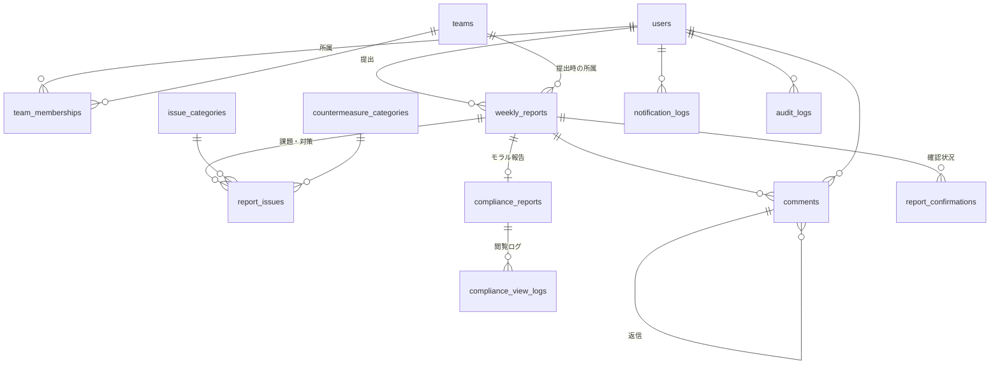

# 週報管理システム DB設計書

- DB: MySQL 8.x / 文字コード utf8mb4 / 照合順序 utf8mb4_ja_0900_as_cs
- ORM: Prisma
- 作成日: 2026-07-21
- 版: 1.0(初版)

---

## 1. ER概要

## 2. テーブル定義

### 2.1 users(ユーザー)

| カラム | 型 | NULL | 説明 |
|---|---|:-:|---|
| id | BIGINT UNSIGNED AUTO_INCREMENT PK | ― | |
| employee_code | VARCHAR(20) UNIQUE | 可 | 社員番号(任意) |
| name | VARCHAR(100) | ― | 氏名 |
| email | VARCHAR(255) UNIQUE | ― | メールアドレス(ログインID兼Teamsメンション用) |
| password | VARCHAR(255) | ― | 平文(ローカル運用の割り切り) |
| role | ENUM('member','manager','executive','admin') | ― | ロール |
| must_change_password | BOOLEAN DEFAULT TRUE | ― | 初回ログイン時のパスワード変更強制 |
| is_active | BOOLEAN DEFAULT TRUE | ― | 退職者はFALSE(レコードは保持) |
| created_at / updated_at | DATETIME | ― | |

### 2.2 teams(チーム)

| カラム | 型 | NULL | 説明 |
|---|---|:-:|---|
| id | BIGINT UNSIGNED PK | ― | |
| name | VARCHAR(100) | ― | チーム名 |
| is_active | BOOLEAN DEFAULT TRUE | ― | 廃止チームはFALSE |
| created_at / updated_at | DATETIME | ― | |

### 2.3 team_memberships(所属履歴)

異動対応のため期間付きで保持。「現在の所属」は `end_date IS NULL` の行。

| カラム | 型 | NULL | 説明 |
|---|---|:-:|---|
| id | BIGINT UNSIGNED PK | ― | |
| user_id | BIGINT UNSIGNED FK→users | ― | |
| team_id | BIGINT UNSIGNED FK→teams | ― | |
| is_leader | BOOLEAN DEFAULT FALSE | ― | このチームの所属長か |
| start_date | DATE | ― | 所属開始日 |
| end_date | DATE | 可 | 所属終了日(NULL=現所属) |
| created_at / updated_at | DATETIME | ― | |

- INDEX: (user_id, end_date), (team_id, end_date)
- 制約(アプリ層): 同一ユーザーの所属期間は重複しない

### 2.4 weekly_reports(週報)

| カラム | 型 | NULL | 説明 |
|---|---|:-:|---|
| id | BIGINT UNSIGNED PK | ― | |
| user_id | BIGINT UNSIGNED FK→users | ― | 提出者 |
| team_id | BIGINT UNSIGNED FK→teams | ― | **提出時点の所属チーム**(異動後も統計を当時のチームに残す) |
| week_start_date | DATE | ― | 対象週の月曜日 |
| status | ENUM('draft','submitted','locked') | ― | 下書き/提出済/ロック |
| work_summary | TEXT | ― | 今週行ったこと |
| self_rating | ENUM('excellent','good','fair','poor') | ― | ◎/○/△/✕ |
| submitted_at | DATETIME | 可 | 提出日時 |
| created_at / updated_at | DATETIME | ― | |

- UNIQUE: (user_id, week_start_date)
- INDEX: (team_id, week_start_date), (week_start_date)

### 2.5 issue_categories(課題マスタ)/ countermeasure_categories(対策マスタ)

2テーブル同一構造。大分類→小分類の2階層。

| カラム | 型 | NULL | 説明 |
|---|---|:-:|---|
| id | BIGINT UNSIGNED PK | ― | |
| parent_id | BIGINT UNSIGNED FK(自己参照) | 可 | NULL=大分類、値あり=小分類 |
| name | VARCHAR(100) | ― | 分類名 |
| sort_order | INT DEFAULT 0 | ― | 表示順 |
| is_active | BOOLEAN DEFAULT TRUE | ― | 無効化で運用(削除しない) |
| created_at / updated_at | DATETIME | ― | |

### 2.6 report_issues(週報の課題・対策)

課題と対策を1行のペアで保持。1週報に複数登録可。

| カラム | 型 | NULL | 説明 |
|---|---|:-:|---|
| id | BIGINT UNSIGNED PK | ― | |
| report_id | BIGINT UNSIGNED FK→weekly_reports | ― | |
| issue_category_id | BIGINT UNSIGNED FK→issue_categories | ― | 小分類を指定 |
| issue_comment | TEXT | 可 | 課題の自由コメント |
| countermeasure_category_id | BIGINT UNSIGNED FK→countermeasure_categories | 可 | 対策未定の場合NULL可 |
| countermeasure_comment | TEXT | 可 | 対策の自由コメント |
| sort_order | INT DEFAULT 0 | ― | |
| created_at / updated_at | DATETIME | ― | |

- INDEX: (report_id), (issue_category_id), (countermeasure_category_id)

### 2.7 compliance_reports(モラル・ハラスメント報告)

週報1件につき0〜1件。通常項目と分離し、閲覧制御・ログを独立させる。

| カラム | 型 | NULL | 説明 |
|---|---|:-:|---|
| id | BIGINT UNSIGNED PK | ― | |
| report_id | BIGINT UNSIGNED FK→weekly_reports UNIQUE | ― | |
| level | ENUM('none','concern','issue') | ― | なし/気になる点あり/問題あり |
| content | TEXT | 可 | 自由記述(level≠noneの場合) |
| visibility | ENUM('manager_and_executive','executive_only') | ― | 公開範囲(本人が選択) |
| created_at / updated_at | DATETIME | ― | |

### 2.8 compliance_view_logs(モラル報告閲覧ログ)

| カラム | 型 | NULL | 説明 |
|---|---|:-:|---|
| id | BIGINT UNSIGNED PK | ― | |
| compliance_report_id | BIGINT UNSIGNED FK | ― | |
| viewed_by | BIGINT UNSIGNED FK→users | ― | |
| viewed_at | DATETIME | ― | |

### 2.9 comments(コメント)

| カラム | 型 | NULL | 説明 |
|---|---|:-:|---|
| id | BIGINT UNSIGNED PK | ― | |
| report_id | BIGINT UNSIGNED FK→weekly_reports | ― | |
| user_id | BIGINT UNSIGNED FK→users | ― | 投稿者 |
| parent_comment_id | BIGINT UNSIGNED FK(自己参照) | 可 | 返信元(NULL=トップレベル) |
| content | TEXT | ― | |
| created_at / updated_at | DATETIME | ― | |

### 2.10 report_confirmations(確認ステータス)

所属長・役員が週報を「確認済み」にした記録。

| カラム | 型 | NULL | 説明 |
|---|---|:-:|---|
| id | BIGINT UNSIGNED PK | ― | |
| report_id | BIGINT UNSIGNED FK→weekly_reports | ― | |
| user_id | BIGINT UNSIGNED FK→users | ― | 確認者 |
| confirmed_at | DATETIME | ― | |

- UNIQUE: (report_id, user_id)

### 2.11 skip_weeks(提出不要週)

| カラム | 型 | NULL | 説明 |
|---|---|:-:|---|
| id | BIGINT UNSIGNED PK | ― | |
| week_start_date | DATE UNIQUE | ― | 対象週の月曜日 |
| reason | VARCHAR(200) | ― | 例: 年末年始休暇 |

### 2.12 notification_logs(通知履歴)

| カラム | 型 | NULL | 説明 |
|---|---|:-:|---|
| id | BIGINT UNSIGNED PK | ― | |
| user_id | BIGINT UNSIGNED FK→users | 可 | 宛先(チャネル全体通知はNULL) |
| type | ENUM('reminder','overdue','comment','submitted','alert') | ― | 通知種別 |
| payload | JSON | ― | 送信内容 |
| status | ENUM('success','failed') | ― | |
| sent_at | DATETIME | ― | |

### 2.13 audit_logs(監査ログ)

| カラム | 型 | NULL | 説明 |
|---|---|:-:|---|
| id | BIGINT UNSIGNED PK | ― | |
| user_id | BIGINT UNSIGNED FK→users | ― | 操作者 |
| action | VARCHAR(50) | ― | 例: report.submit, report.unlock, user.create |
| target_type | VARCHAR(50) | ― | 対象テーブル |
| target_id | BIGINT UNSIGNED | 可 | 対象ID |
| detail | JSON | 可 | 変更内容など |
| created_at | DATETIME | ― | |

### 2.14 app_settings(システム設定)

| カラム | 型 | NULL | 説明 |
|---|---|:-:|---|
| key | VARCHAR(100) PK | ― | 設定キー |
| value | TEXT | ― | 設定値 |

想定キー: `deadline_day_of_week`, `deadline_time`, `reminder_time`, `teams_webhook_url`, `alert_consecutive_low_weeks` など

## 3. 統計クエリの方針

- 評価分布・推移: `weekly_reports` を `team_id` × `week_start_date` でGROUP BY
- 課題カテゴリ集計: `report_issues` を `issue_categories.parent_id`(大分類)で集計
- モラル報告件数: `compliance_reports.level != 'none'` の件数のみ(内容は非表示)
- データ量が小さい(数万件)ため集計テーブルは持たず、都度クエリで算出する

## 4. 補足

- 「所属長が誰か」は `team_memberships.is_leader = TRUE AND end_date IS NULL` で判定(1チームに複数可)
- 週報閲覧権限の判定は、閲覧者の現ロール+週報の `team_id` と閲覧者の現所属で行う
- 4段階評価のDB値は `excellent/good/fair/poor` とし、表示層で ◎/○/△/✕ に変換する
