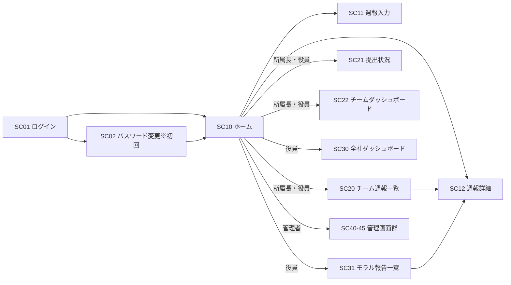

# 週報管理システム 画面設計書

- 作成日: 2026-07-22
- 版: 1.0(初版)
- 関連: 01_要件定義書.md / 02_DB設計書.md

---

## 1. 画面一覧

| 画面ID | 画面名 | 利用ロール | 概要 |
|---|---|---|---|
| SC01 | ログイン | 全員 | メールアドレス+パスワード |
| SC02 | パスワード変更 | 全員 | 初回ログイン時は強制表示 |
| SC10 | ホーム(マイページ) | 全員 | 今週の提出状況、自分の週報時系列、未読コメント |
| SC11 | 週報入力 | 全員 | 新規作成・編集(下書き保存/提出) |
| SC12 | 週報詳細 | 全員(権限による) | 週報内容+コメントスレッド。ロールで操作が変化 |
| SC13 | 過去の週報(月別) | メンバー・所属長 | 自分の週報を月単位で一覧表示 |
| SC14 | 個人週報(月別) | 所属長・役員 | 対象者を選び、その人の週報を月単位で一覧表示 |
| SC20 | チーム週報一覧 | 所属長・役員 | メンバー×週のマトリクス表示、時系列閲覧 |
| SC21 | 提出状況一覧 | 所属長・役員 | 未提出者の把握(役員は全チーム) |
| SC22 | チームダッシュボード | 所属長・役員 | チーム統計(評価分布・推移、課題カテゴリ) |
| SC30 | 全社ダッシュボード | 役員 | 全体統計+チーム別比較 |
| SC31 | モラル・ハラスメント報告一覧 | 所属長・役員 | 報告のあった週報の一覧(閲覧ログ記録)。所属長は「所属長・役員に公開」の報告のみ |
| SC40 | ユーザー管理 | 管理者 | 登録・編集・無効化 |
| SC41 | チーム管理 | 管理者 | チーム作成、所属長割当、所属設定(期間付き) |
| SC42 | マスタ管理 | 管理者 | 課題・対策マスタ(大分類/小分類、無効化) |
| SC43 | 週・締切設定 | 管理者 | 提出不要週、締切曜日・時刻、リマインダー時刻 |
| SC44 | 監査ログ | 管理者・役員 | 操作履歴の検索・閲覧 |
| SC45 | システム設定 | 管理者 | Teams Webhook URL、アラート条件など |

## 2. 画面遷移図



## 3. 共通レイアウト

```
+--------------------------------------------------------------+
| ロゴ 週報管理システム        [通知🔔] [ユーザー名 ▼(ログアウト)] |
+----------+---------------------------------------------------+
| サイド    |                                                   |
| メニュー  |   メインコンテンツ                                  |
| (ロール別)|                                                   |
+----------+---------------------------------------------------+
```

- サイドメニューはロールにより表示項目が変わる
  - 全員: ホーム / 週報を書く
  - 所属長: +チーム週報 / 提出状況 / チームダッシュボード
  - 役員: +全社ダッシュボード / モラル報告 / (全チーム閲覧)
  - 管理者: +管理(ユーザー/チーム/マスタ/週設定/監査ログ/システム設定)
- スマホ表示時はサイドメニューをハンバーガーメニューに格納(閲覧・コメント操作を優先対応)

## 4. 主要画面レイアウト

### SC10 ホーム(マイページ)

```
+--------------------------------------------------------------+
| 今週の週報: 未提出   締切: 7/24(金) 18:00   [今週の週報を書く] |
+--------------------------------------------------------------+
| 未読コメント (2)                                              |
|  ・7/14週の週報に 山田所属長 からコメント        [開く]        |
+--------------------------------------------------------------+
| 自分の週報(時系列)                [評価推移グラフ ◎○△✕]      |
|  7/14週  ○  提出済  コメント2件                 [詳細]        |
|  7/7週   ◎  提出済  コメント1件                 [詳細]        |
|  6/30週  △  提出済  コメント3件                 [詳細]        |
+--------------------------------------------------------------+
```

### SC11 週報入力

```
+--------------------------------------------------------------+
| 週報入力  対象週: 2026/7/20(月) 〜 7/26(日)                    |
|                              [先週の内容をコピー]              |
+--------------------------------------------------------------+
| ■ 今週行ったこと(必須)                                        |
| [テキストエリア                                        ]      |
+--------------------------------------------------------------+
| ■ 課題と対策                              [+ 課題を追加]      |
| ┌ 課題1 ─────────────────────────────── [削除] ┐            |
| │ 課題(必須):  [大分類 ▼] [課題 ▼]                 │            |
| │  ▎必要な情報が共有されず認識のズレが生じている ←説明 │            |
| │ 課題詳細:    [テキスト                   ]        │            |
| │ 対策(任意):  [大分類 ▼] [対策 ▼]                 │            |
| │  ▎打ち合わせや共有の頻度・方法を変えて認識を揃える  │            |
| │ 対策詳細:    [テキスト                   ]        │            |
| └───────────────────────────────────────┘            |
+--------------------------------------------------------------+
| ■ 自己評価(必須)   ( )◎  ( )○  ( )△  ( )✕                  |
+--------------------------------------------------------------+
| ■ ビジネスモラル・ハラスメント                                 |
| (●)なし ( )気になる点あり ( )問題あり                         |
| ▼「あり」選択時に表示                                         |
|   内容: [テキストエリア                              ]        |
|   公開範囲: (●)所属長・役員に公開 ( )役員のみに公開            |
+--------------------------------------------------------------+
|                            [下書き保存]  [提出する]           |
+--------------------------------------------------------------+
```

- 提出後も締切までは再編集可(ボタンは「更新する」に変化)
- 締切後は閲覧のみ(管理者がロック解除した場合を除く)

### SC12 週報詳細

```
+--------------------------------------------------------------+
| 佐藤太郎(営業1課) 7/14週の週報   評価: ○   提出: 7/18 17:32   |
|                     [確認済みにする](所属長・役員のみ表示)     |
+--------------------------------------------------------------+
| 今週行ったこと: ...                                           |
| 課題・対策:                                                   |
|   [営業/新規開拓] リード不足 → [体制/プロセス改善] 架電枠拡大   |
| モラル・ハラスメント: なし                                     |
|   ※「役員のみ公開」の報告は役員以外には項目ごと非表示           |
+--------------------------------------------------------------+
| コメント                                                      |
|  山田所属長 7/18 18:05: 新規リードの件、来週相談しましょう      |
|    └ 佐藤 7/18 18:20: 承知しました                            |
|  [コメントを書く                              ] [送信]        |
+--------------------------------------------------------------+
| < 前の週 |  時系列ナビ  | 次の週 >                             |
+--------------------------------------------------------------+
```

- コメント可否: 所属長=自事業室の週報 / 役員=全週報 / 本人=返信のみ
  - 本人の返信欄は各コメントの下に常時表示(折りたたまない)
  - コメント登録時、週報の本人へTeams通知が飛ぶ
- モラル欄の表示時に閲覧ログを記録(compliance_view_logs)

### SC13 / SC14 月別の週報一覧

SC13(メンバー: 自分の週報)と SC14(所属長・役員: 対象者を選択)は同じ表示形式。

```
+--------------------------------------------------------------+
| [対象者: 制作室/保坂久美子 ▼][表示]  表示月: [2026年7月 ▼][表示]|
|  ※対象者の選択はSC14のみ                                       |
+--------------------------------------------------------------+
| 2026年7月の週報 4件(新しい週が上、古い週が下)                  |
| ┌ 2026/7/27(月)〜8/2(日)  ○ 良い  提出済  提出 7/31 17:00 ┐  |
| │  [詳細・コメント2件]                                      │  |
| │  今週行ったこと / 課題と対策 / モラル・ハラスメント        │  |
| └─────────────────────────────────────┘  |
| ┌ 2026/7/20(月)〜7/26(日)  △ 課題あり ...                 ┐  |
|  ↓ スクロールで古い週へ                                       |
+--------------------------------------------------------------+
```

- 週は「週開始日(月曜)が属する月」で振り分ける
- 初期表示は当月。当月にまだ週報がない場合は、週報がある直近の月を表示する
- 年月プルダウンには週報が存在する月+当月を新しい順で並べる
- モラル・ハラスメント欄は閲覧者と公開範囲で出し分ける(本人・役員は常に表示、
  所属長は「所属長・役員に公開」のみ表示)。内容自体はSC12で確認する

### SC20 チーム週報一覧(所属長・役員)

```
+--------------------------------------------------------------+
| 事業室: [制作室 ▼](役員のみ切替可)   凡例: ◎ ○ △ ✕          |
+--------------------------------------------------------------+
| メンバー      | 7/27週    | 7/20週  | 7/13週  | ...           |
| 山田航平 所属長| [○ 提出済] | 未提出  | 未提出  |               |
| 保坂久美子    | [◎ 提出済] | [△ 提出済]| 未提出  |               |
| 小菅亮 ⚠      | [△ 提出済] | [△ 提出済]| [✕ 提出済]|             |
+--------------------------------------------------------------+
| ⚠ アラート: 小菅亮さんは低評価が3週連続しています               |
+--------------------------------------------------------------+
```

- **役員は提出対象外のため一覧に表示しない**(提出対象者がいない事業室は選択肢にも出ない)
- セルは「◎ 提出済」形式のボタン。クリックで SC12(週報詳細)へ遷移しコメントを登録できる
- 未提出のセルは「未提出」と表示(リンクなし)
- ⚠はアラート条件(△・✕が3週連続 等)該当者

### SC21 提出状況一覧(所属長・役員)

```
+--------------------------------------------------------------+
| [‹ 前週]  2026/7/27(月)〜8/2(日)  [翌週 ›]                     |
|                              [未提出者17名にまとめて送信]      |
+--------------------------------------------------------------+
| 提出率 6%  |  未提出 17名  |  確認待ち 1件                     |
+--------------------------------------------------------------+
| 氏名        |事業室 |状態  |評価|提出日時   |確認  | 操作      |
| 山田航平 所属長|制作室|提出済| ○ |7/30 15:19|未確認|[週報を開く]|
| 安藤圭佑 所属長|制作室|未提出| ― |    ―     | ―   |[リマインド]|
| 保坂久美子   |制作室|未提出| ― |    ―     | ―   |[リマインド]|
+--------------------------------------------------------------+
```

- **チーム単位でまとめず、対象者全員を1つのリストに表示**(事業室は列で表示)
- **役員は提出対象外のため一覧に含まない**
- 対象週は矢印ボタンで前週・翌週に移動。初期表示はログイン日の週
  (未来週には進めないよう「翌週」は当週で無効化)
- 提出日時・自分の確認状況を表示。提出済は[週報を開く]でSC12へ
- [リマインド]で対象者へTeams通知を手動送信(個別/一括、自動リマインダーとは別)
- 役員は全事業室、所属長は自事業室のみ表示

### SC22 チームダッシュボード

```
+--------------------------------------------------------------+
| チーム: [営業1課 ▼]  期間: [2026年4月〜7月 ▼]                 |
+--------------------------------------------------------------+
| [評価分布 円グラフ]   [評価推移 折れ線(週×平均評価)]           |
+--------------------------------------------------------------+
| [課題カテゴリ出現頻度 横棒グラフ(大分類)]                      |
|   クリックで小分類にドリルダウン                               |
+--------------------------------------------------------------+
| [対策カテゴリ出現頻度]        [前期間との比較表]               |
+--------------------------------------------------------------+
```

> ダッシュボードの集計対象はメンバー・所属長のみ。**役員は人数・提出率・評価のいずれにも含めない。**

### SC30 全社ダッシュボード(役員)

- SC22と同構成の全社版+以下を追加:
  - チーム別比較表(平均評価 / 提出率 / 課題件数 / アラート数)
  - モラル・ハラスメント報告件数の推移(件数のみ。内容はSC31から)
  - CSVエクスポートボタン(役員報告資料用)

### SC31 モラル・ハラスメント報告一覧(役員)

```
+--------------------------------------------------------------+
| 期間: [直近3ヶ月 ▼]  レベル: [すべて ▼]                       |
+--------------------------------------------------------------+
| 週     | 報告者   | チーム  | レベル       | 公開範囲  | 操作  |
| 7/14週 | (氏名)   | 営業1課 | 気になる点   | 役員のみ  |[詳細] |
+--------------------------------------------------------------+
```

- 詳細を開くと該当週報のSC12へ(閲覧ログ記録)

### SC40〜45 管理画面群(管理者)

一覧+編集モーダルの標準的なCRUD構成。特記事項のみ:

- **SC41 チーム管理**: メンバーの所属設定は「異動日」を指定して登録(現所属にend_dateを設定し新規行を追加)。所属長はチームごとに1名指定
- **SC42 マスタ管理**: 大分類 → 課題(対策)のツリー表示。各項目に説明を表示し、[編集]で名称と説明を変更できる。
  新規追加時も説明を入力できる。削除ボタンは無く「無効化」のみ。使用実績のある項目には「使用実績あり」を表示
- **SC43 週・締切設定**: カレンダーから提出不要週を選択。締切曜日/時刻、リマインダー時刻の設定
- **SC45 システム設定**: Teams Webhook URL(テスト送信ボタン付き)、アラート条件(連続低評価の週数)

## 5. 通知とTeamsの連携UI

- ヘッダーの通知ベル🔔: アプリ内通知(未読コメント、アラート)の一覧をドロップダウン表示
- Teams通知はチャネル投稿+本人メンション。通知文面には該当画面への直リンクを含める

## 6. レスポンシブ対応方針

| 画面 | スマホ対応 |
|---|---|
| SC10/SC12(閲覧・コメント) | 完全対応 |
| SC11(週報入力) | 対応(課題カードは縦積み) |
| SC20〜SC31(一覧・ダッシュボード) | 閲覧のみ対応(横スクロール許容) |
| SC40〜45(管理) | PC専用 |
